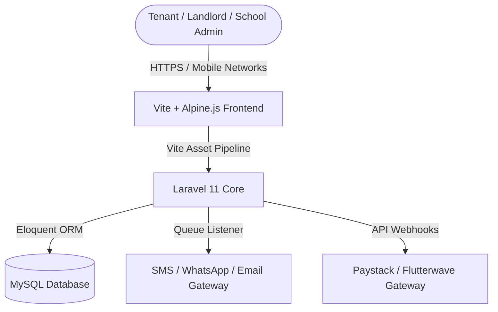

# Hausify (EPM-S) ─ Enterprise Property Management Suite MVP

Hausify (**EPM-S**) is a highly-structured, production-ready Enterprise Property Management Suite MVP tailored specifically for the Nigerian and wider Sub-Saharan African real estate markets. Designed to eliminate the operational chaos of fragmented records, manual rent tracking, and scattered receipts, Hausify automates landlord-tenant lifecycles in a high-performance **Technical Grid** layout.

---

## Target Segments & Tailored Use Cases

Hausify is engineered to support multiple verticals, adapting its units and billing frameworks to fit local property archetypes:

### 1. Landlords & Residential Estates
*   **Residential & Commercial Complexes**: Manage multi-flat layouts, shops, and office plazas.
*   **Service Charge Administration**: Automate diesel power levies, security fees, and waste disposal bills.
*   **Localized Tenant Onboarding**: Digitally log tenancy application forms, guarantor records, and official KYC (e.g., NIN, BVN validation hints).

### 2. Private & Academic Hostels
*   **Bed Space Allocations**: Model rooms into discrete bed spaces (e.g., Bed A, Bed B) with individual pricing rules.
*   **Hostel Wardens Terminal**: Check-in/check-out students, log security clearance statuses, and track utility histories.
*   **Short-Term / Session Billing**: Support 3-month, 6-month, and academic session leases.

### 3. Schools & Academic Boarding
*   **Boarding House Ledgers**: Track school dormitory allocations integrated directly with terminal school fee invoices.
*   **House Master Console**: Log house reports, track active room occupancies, and manage repair workflows for specific school blocks.

### 4. Property Management & Real Estate Agencies
*   **Multi-Owner Portfolios**: Support agents managing portfolios belonging to multiple external landlords.
*   **Commission & Revenue Splits**: Auto-calculate agency commissions (e.g., 10% standard) and withholding tax (WHT) before routing payouts.
*   **Property Inspector Ticketing**: Let inspection officers generate live inspection checklists and upload photographs of maintenance requirements.

---

## Core Production-Ready MVP Features

To thrive in the local Nigerian environment, Hausify implements specialized operational blocks:

*   ** Localized Payment Gateways**: Ready-to-go API scaffolding for **Paystack** and **Flutterwave**. Supports:
    *   *NUBAN Bank Transfers* (with automated account generation per invoice).
    *   *USSD payments* (MTN, Airtel, Glo, 9mobile).
    *   *Debit Card processing* (Verve, Mastercard, Visa).
*   ** Automated SMS & WhatsApp Reminders**: Integrated queue listeners for **Termii**, **Twilio**, or **Multitexter** APIs. Dispatches automated rent reminders, maintenance ticket status alerts, and payment receipts straight to tenants' phones.
*   ** Low-Bandwidth Optimization**: Lightweight HTML structures, pre-compiled static CSS assets, and minimal JS payload ensure pages load fast on standard mobile networks (2G/3G/4G).
*   ** Local Regulatory Compliances**: Handles standard calculations for **Withholding Tax (WHT)** on rental income, agency commission percentages, and local tenancy association levies.

---

## Technical Architecture & Stack

*   **Backend**: PHP 8.2+ ─ Laravel 11 Framework (MVC, Eloquent, Queue Jobs).
*   **Frontend**: Vite 7.0+ Pipeline ─ Tailwind CSS v3 (Dynamic Grid System) & Alpine.js (Reactive States).
*   **Database**: MySQL 8.0+ / PostgreSQL 15+.
*   **Caching & Queueing**: Redis / Database Queue driver for robust background SMS queues.
# spe
